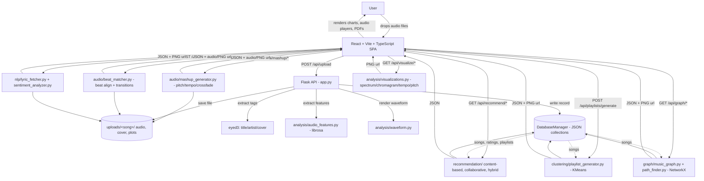

# SongSift

Local music workbench: drop in your own audio, get feature-based recs, a similarity map, beat-matched mashups, and lyric sentiment — computed on your machine.

| | |
| --- | --- |
| **Author** | [Rahil Sheth](https://github.com/rsheth8) |
| **Repo** | [rsheth8/SongSift](https://github.com/rsheth8/SongSift) |
| **Stack** | Python (Flask, librosa, scikit-learn, NetworkX), React 18, Vite, TypeScript |
| **Status** | Local-only. You supply the files; analysis stays on disk. |

Logs and a few backend modules still say “TuneSift” (old name). Same app.

---

## What this is

SongSift is a web app for people who want to explore their own music collection in ways a normal music player doesn't support. You drop in a folder of MP3/WAV/FLAC/OGG/M4A files, and the app:

- Figures out the tempo, key, energy, and "mood" of each track by actually analyzing the audio (not just reading tags)
- Suggests other songs in your library that sound similar, using three different recommendation methods
- Groups your library into auto-generated playlists based on how songs sound (fast/energetic vs. slow/mellow, etc.)
- Draws a visual "map" of your library where similar songs are connected, and can plot a path from one song to another through musically-related tracks
- Lets you mash up two songs together — pitch-shifting and tempo-matching them and crossfading between them — and preview the result
- Can chain beat-matched transitions across an entire playlist into one continuous mix, like a simple DJ set
- Pulls lyrics for a song and runs sentiment/emotion analysis on them, with charts

There are no third-party accounts to log into for music — you provide your own audio files, and everything (analysis, storage, generated audio/images) stays on your local disk. A minimal username/password system exists only to attribute ratings to a user for the collaborative-filtering recommender.

---

## Key features

- **Audio feature extraction** (`librosa`) — tempo, beat times, spectral centroid, chroma, MFCCs, RMS energy, rolled up into "energy"/"mood" style features per song
- **Three recommendation engines**, selectable per request:
  - *Content-based* — cosine similarity over the engineered feature vector
  - *Collaborative filtering* — a user × song rating matrix
  - *Hybrid* — content-based recommendations seeded by collaborative predictions, plus a mood-only mode
- **Clustering-based playlist generator** — KMeans over the feature matrix, producing named playlists with a 2-D cluster visualization (PNG)
- **Music similarity graph** (`networkx`) with three path-finding strategies between two songs: shortest path, "most diverse" path, and "smooth transition" path — plus a "musical journey" generator from a single seed song
- **Mashup studio** — pitch shift + tempo adjustment + beat-aligned crossfade between two tracks, with a compatibility score, live preview, and a saved final mashup
- **Playlist mixer** — chains beat-matched transitions across an entire playlist into one continuous audio file
- **Lyric analysis** — fetches lyrics for a track and runs sentiment + emotion classification, with generated charts
- **On-demand visualizations** — waveform, spectrum, chromagram, tempo, and pitch plots per song

---

## How it works

1. **Upload** — The user drops audio files into the React frontend, which POSTs them (multipart) to the Flask backend's `/api/upload` endpoint.
2. **Ingest** — For each file, the backend: validates the extension, saves it to a per-song folder under `uploads/`, reads ID3 tags (title/artist/embedded album art) with `eyed3`, runs `librosa`-based feature extraction, renders a waveform PNG, generates a deterministic song ID (MD5 hash of title+artist), and writes a `Song` record into the JSON "database."
3. **Store** — All structured data (songs, ratings, playlists, mashups, transitions, users) lives in flat JSON files managed by a thread-safe `DatabaseManager`, with locks per collection so concurrent Flask requests don't corrupt writes. Generated audio and images are written directly to disk under `uploads/`.
4. **Interact** — The frontend calls various `/api/...` endpoints depending on what the user is doing: requesting recommendations, generating playlists, building the similarity graph, requesting a mashup, or fetching/analyzing lyrics.
5. **Compute on demand** — Each of those actions is handled by a dedicated backend module (recommendation engine, clustering generator, graph builder, mashup/beat-matching engine, or lyric analyzer) that reads the relevant songs/ratings out of the JSON store, does the computation with `pandas`/`scikit-learn`/`networkx`/`librosa`, and — where relevant — writes a new image or audio file to `uploads/` and returns its URL in the JSON response.
6. **Render** — The React app reads the JSON response and displays it: charts (`chart.js`, `recharts`), audio players pointing at the generated files, exported PDFs (`jspdf`/`html2canvas`), etc.



---

## Tech stack

| Layer | Libraries |
|---|---|
| Audio analysis | `librosa`, `numpy`, `soundfile` |
| Metadata extraction | `eyed3` (ID3 tags, embedded album art) |
| Modeling / clustering | `scikit-learn` (KMeans, cosine similarity, scalers) |
| Similarity graph | `networkx` |
| Lyric NLP | `textblob`, `nltk` |
| Data handling | `pandas` |
| Plots | `matplotlib`, `seaborn` |
| Backend API | `Flask`, `flask-cors`, `Werkzeug` |
| Frontend | React 18, Vite, TypeScript |
| Frontend UI/data | `chart.js` + `react-chartjs-2`, `recharts`, `react-router-dom`, `react-icons` |
| Export | `jspdf`, `html2canvas` |

---

## Project structure

```
SongSift/
├── backend/
│   ├── app.py                      # Flask app — every API route is defined here
│   ├── analysis/
│   │   ├── audio_features.py       # librosa-based feature extraction
│   │   ├── waveform.py             # waveform PNG renderer
│   │   └── visualizations.py       # spectrum / chromagram / tempo / pitch plots
│   ├── recommendation/
│   │   ├── content_based.py        # cosine similarity on feature vectors
│   │   ├── collaborative.py        # user x song rating matrix
│   │   └── hybrid.py               # content + collaborative blend, mood mode
│   ├── clustering/
│   │   ├── playlist_generator.py   # KMeans -> named playlists
│   │   └── visualizations.py       # cluster plots
│   ├── graph/
│   │   ├── music_graph.py          # builds the NetworkX similarity graph
│   │   └── path_finder.py          # shortest / diverse / smooth paths, journeys
│   ├── audio/
│   │   ├── mashup_generator.py     # pitch shift / tempo adjust / crossfade
│   │   └── beat_matcher.py         # beat extraction, alignment, transitions
│   ├── nlp/
│   │   ├── lyric_fetcher.py        # fetches lyrics for a track
│   │   └── sentiment_analyzer.py   # sentiment + emotion classification
│   ├── models/                     # Song / User / Playlist domain models
│   ├── database/db_manager.py      # thread-safe JSON "collection" store
│   ├── utils/                      # file handling, API client helpers
│   ├── templates/index.html
│   ├── data/                       # JSON collections (gitignored, created at runtime)
│   └── uploads/                    # per-song audio, covers, plots, mashups (gitignored)
└── frontend/
    ├── package.json                # React 18, Vite, chart.js, recharts, etc.
    ├── vite.config.ts
    └── src/
        ├── App.tsx
        ├── components/             # upload, player, recommendations, mashup UI, etc.
        ├── hooks/                  # useAudioAnalysis, useAuth, useSongLibrary
        ├── services/                # api.ts (typed API client), audioService, storageService
        ├── styling/                # per-component CSS
        ├── types/                  # song / user / analysis TypeScript types
        └── utils/
```

---

## Setup / running locally

**Backend** (Python 3, Flask dev server on port 5001):

```bash
cd backend
python3 -m venv .venv
source .venv/bin/activate
pip install -r requirements.txt
python app.py
```

**Frontend** (Vite dev server on port 5173, proxies `/api` to the backend):

```bash
cd frontend
npm install
npm run dev
```

Then open the frontend URL, upload a folder of audio files, and use the UI to explore recommendations, generate playlists, view the music map, build mashups, or analyze lyrics.

Other frontend scripts (from `frontend/package.json`): `npm run build` (type-check + production build), `npm run lint`, `npm run preview`.

Supported audio formats: `.mp3`, `.wav`, `.ogg`, `.flac`, `.m4a`. Max upload size is 50 MB per file (`MAX_CONTENT_LENGTH` in `backend/app.py`).

---

## Notable implementation details

- **JSON-file persistence, not a real database.** `DatabaseManager` (`backend/database/db_manager.py`) stores each "collection" (songs, ratings, playlists, users, mashups, transitions) as a JSON file, with per-collection threading locks so concurrent Flask requests don't race on writes. Every access goes through a small `find` / `find_one` / `insert_one` / `update_one` API, so swapping in SQLite/Postgres later would mean replacing one class rather than rewriting call sites.
- **NaN/Infinity scrubbing.** `librosa` occasionally returns `NaN` or `inf` for pitch/chroma estimates on quiet audio stretches. `clean_nan_values()` in `app.py` recursively walks outgoing JSON payloads and converts these to `None` so the frontend never receives an invalid number.
- **Adaptive similarity threshold for the graph.** The music similarity graph (`/api/graph/music-map`, `/api/graph/path`, `/api/graph/journey`) uses a configurable `similarity_threshold`. If the resulting graph ends up with no edges (common for small or very diverse libraries), the backend automatically retries with a lower threshold (down to `0.1`) so the visualization/paths remain meaningful instead of returning an empty graph.
- **Two-pass pitch + tempo adjustment for mashups.** In `audio/mashup_generator.py`, pitch-shifting is applied to the tempo-adjusted file (not the other way around) so the perceptual key stays consistent through the beat-aligned crossfade region.
- **Deterministic song IDs.** Each song's ID is an MD5 hash of its lowercased `title_artist` string, so re-uploading the same file updates the existing record instead of creating a duplicate.
- **Minimal, session-based auth.** User registration/login exists mainly to attribute ratings to a user ID for the collaborative-filtering recommender; sessions are Flask's built-in cookie session, with no JWT/HTTPS hardening — fine for local use, not production-ready as-is.
- **No streaming uploads.** Files are fully buffered to disk before processing, which is part of why upload size is capped at 50 MB.
